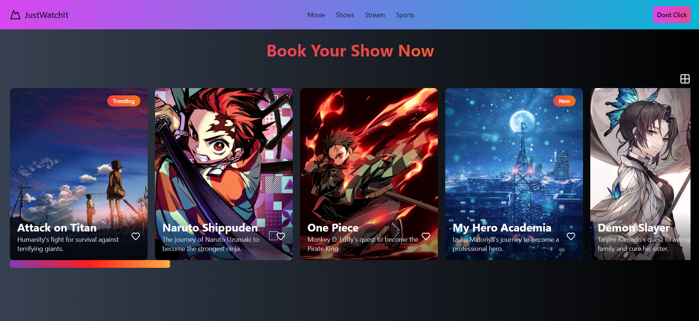
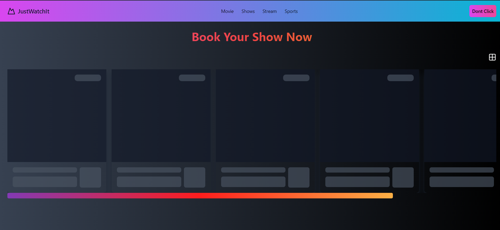
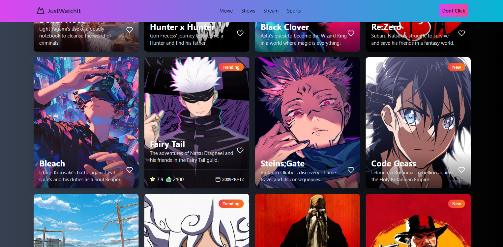

# MAP_Frontend_Challenge_01 ([live](https://book-it-pi.vercel.app/))

## Table of Contents

- [Installation](#installation)
- [Usage](#usage)
- [Features](#features)
- [Screenshots](#screenshots)
- [License](#license)

## Installation

To get started with this project, follow the steps below:

1. **Clone the repository**:

    ```sh
    git clone https://github.com/Hruthik-28/MAP_Frontend_Challenge_01
    cd MAP_Frontend_Challenge_01
    ```

2. **Install dependencies**:

    Make sure you have [Node.js](https://nodejs.org/) installed. Then run:

    ```sh
    npm install
    ```

3. **Start the development server**:

    ```sh
    npm run dev
    ```

## Usage

After following the installation steps, you can start using the project. The application will be available at `http://localhost:3000`.

## Features

- Horizontal scrollable list of cards
- Responsive design with Tailwind CSS
- Smooth transitions and hover effects
- Customizable card components
- Loading skeleton for better user experience

## Screenshots

### Home Page



### Card Skeleton



### Hovered Card 


### Horizontal View and Scroll


### Grid View



## License

This project is licensed under the MIT License - see the [LICENSE](LICENSE) file for details.
